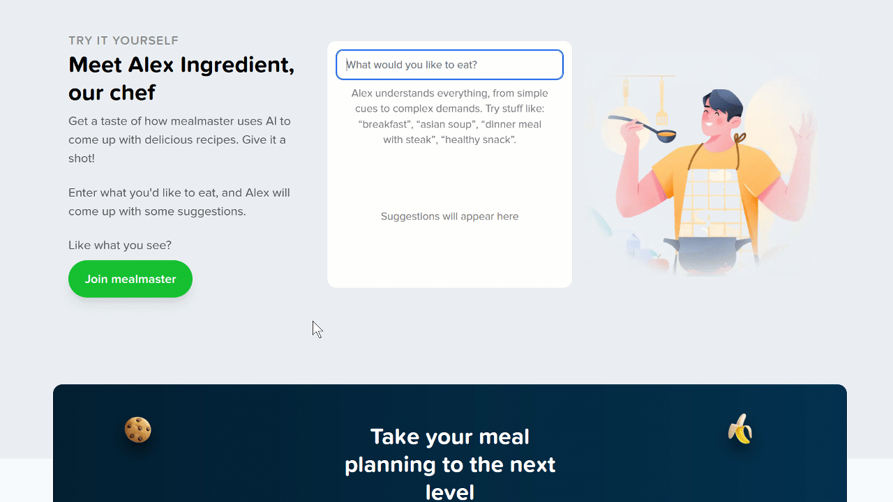
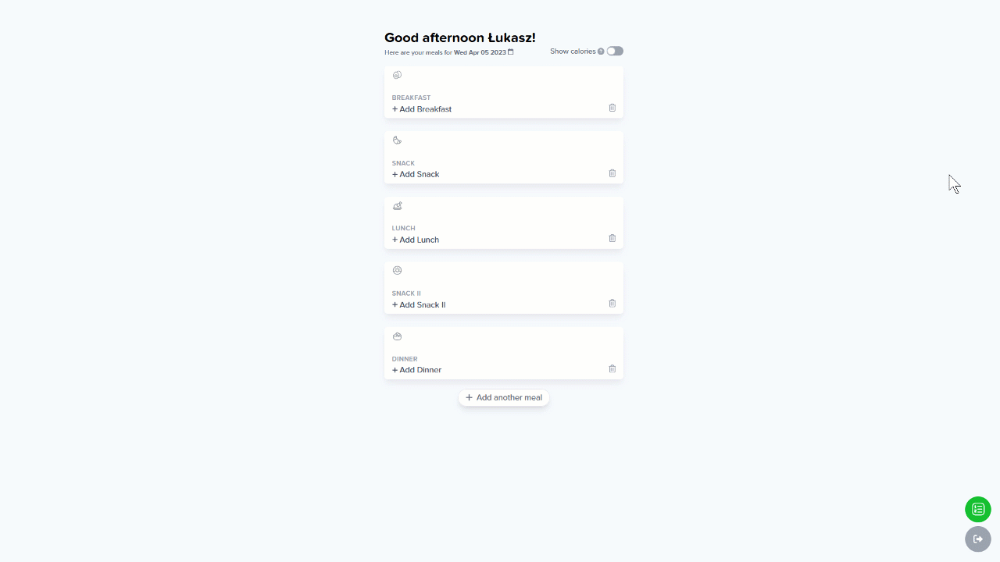
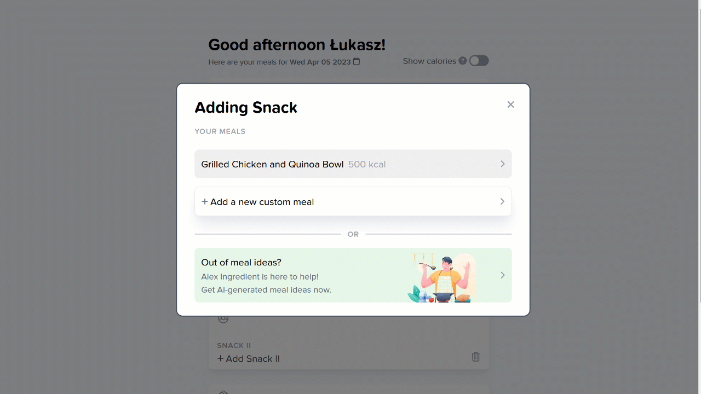
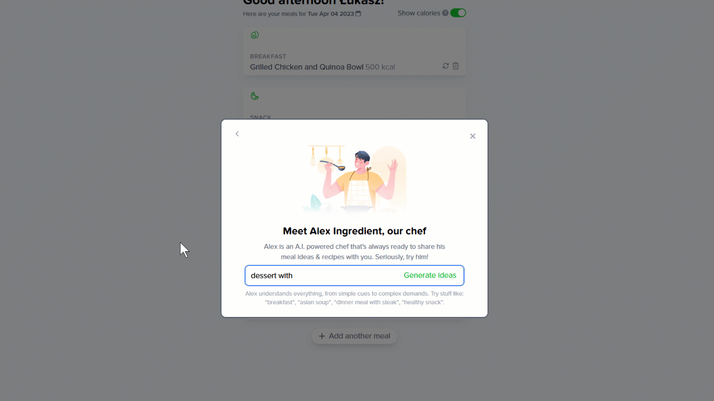
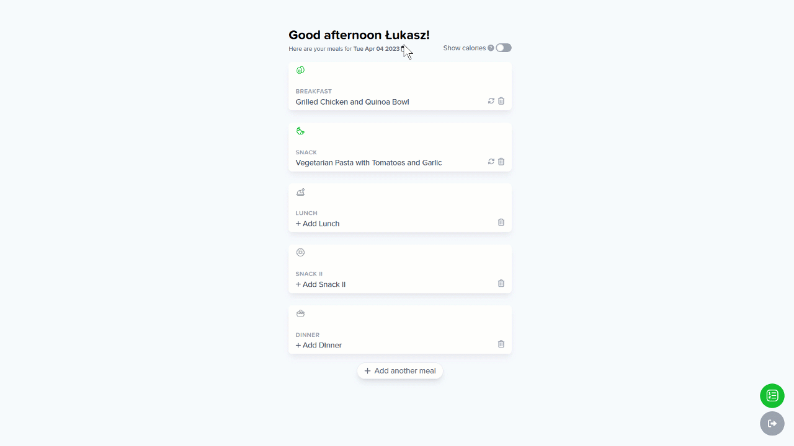
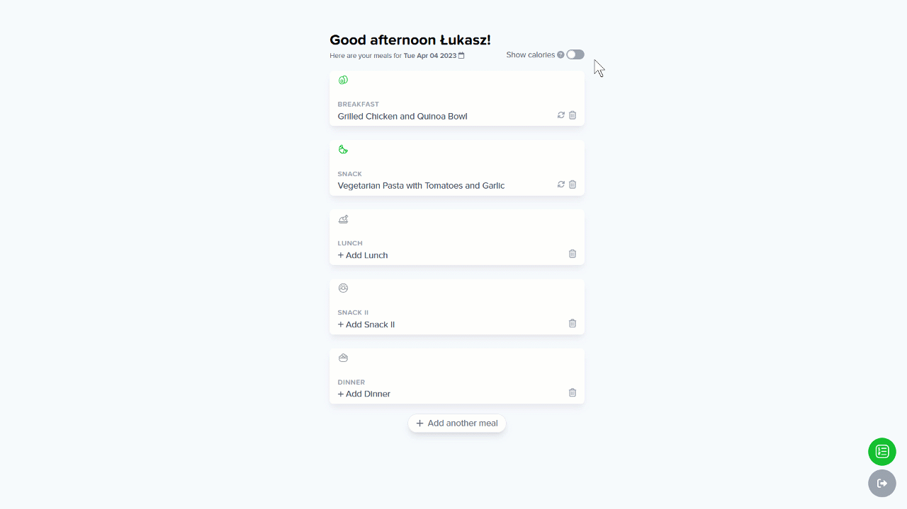

MealMaster is a simple and intuitive meal planned, that is also powered by AI to help you come up with meal ideas.

## Features

- Test AI on a landing page
- Create your own meal routine.
- Add a custom meal.
- Switch selected meal for something else.
- Have AI create a meal and a recipe for you.
- Add new item to the menu if 5 meals is not enough.
- Use calendar to switch between days.

### Landing page

### Test AI on a landing page

### Add a new meal

### Add a custom meal

### Have AI create a meal recipe for you

### Use calendar to switch dates

### Use calories switch to display calories

## Usage

To use the app, you need to log in first. Currently only Google login is supported. Once you log in you can start planning meals. Use the calendar to select a day. Click on the meal (Breakfact, Lunch, ...) to open meal selection window. Here you can select on of your meals, create a new one or have AI suggest a meal and a recipe for you.

## Technologies Used
- NextJS
- Context API
- Tailwind
- Framer Motion
- Auth0
- OpenAI
- MongoDB

## Installation
- Clone the repository using `https://github.com/lfilipiuk/mealmaster.git`
- Install the required dependencies using `npm install`
- Start the development server using `npm start`
- Access the app at http://localhost:3000/
- NOTE: To use the app locally, you will need to create your own MongoDB cluster, Auth0, OpenAI account.

## Contributing

I welcome all contributions, including bug reports, feature requests, and pull requests.
